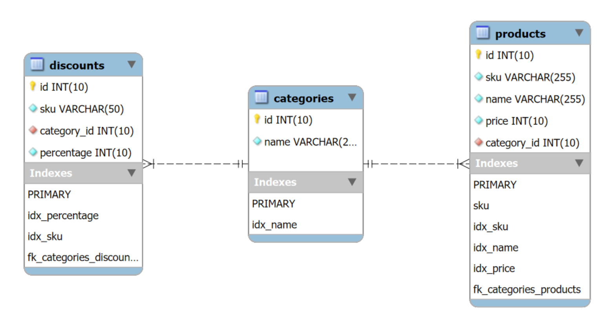

# Implementation Details

## Overview

This document outlines the technical implementation of the MyTheresa Promotions Test. The solution emphasizes efficient filtering, dynamic discount application, and cursor-based pagination for handling large datasets. Redis is used to optimize discount retrieval.

---

## Key Components

### 1. **Database Schema**
The database follows a normalized design to ensure scalability and maintainability:
- **`products` Table:**
  - Fields: `id`, `sku`, `name`, `price`, `category_id`.
  - Purpose: Stores all product details, with a foreign key linking to the `categories` table.
- **`categories` Table:**
  - Fields: `id`, `name`.
  - Purpose: Manages product categories.
- **`discounts` Table:**
  - Fields: `id`, `sku`, `category_id`, `discount_percentage`.
  - Purpose: Tracks discounts applied to products by `sku` or `category`.

This schema minimizes redundancy and simplifies relationships between entities.



---

### 2. **Cursor-Based Pagination**
Cursor-based pagination is implemented to efficiently handle large datasets:
- **How It Works:**
  - Responses include `next` and `prev` cursors.
  - Cursors encode the last/first product ID to fetch the next/previous slice of data.

Cursor-based pagination is faster and more efficient than traditional offset-based pagination for large datasets. Here’s why:

1. **Avoiding OFFSET:**
   - Offset-based pagination fetches rows using `LIMIT` and `OFFSET`. As the page number increases, the database must skip more rows to locate the desired records.
   - This becomes costly as it involves scanning an increasing number of rows, even though they are not part of the final result.

2. **Using a Cursor:**
   - Cursor-based pagination uses a unique identifier (e.g., `id`) to fetch rows that come after or before a given reference point.
   - The database only retrieves the rows matching the conditions, avoiding the need to skip unnecessary rows.

3. **Efficient Indexing:**
   - With proper indexes on the cursor column (e.g., `id`), the database can quickly locate the starting point and fetch the required rows, ensuring consistent performance regardless of the dataset size.

### SQL Examples

#### Offset-Based Pagination
```sql
-- Fetch products for page 5 with 10 products per page
SELECT * 
FROM products
ORDER BY id
LIMIT 10 OFFSET 40;
```
- **How it works:**
  - `LIMIT 10` fetches 10 rows.
  - `OFFSET 40` skips the first 40 rows.
- **Drawbacks:**
  - As `OFFSET` increases, the database still processes and skips the earlier rows, even though they are not needed.

#### Cursor-Based Pagination
```sql
-- Fetch products after the last product ID from the previous page
SELECT * 
FROM products
WHERE id > 50
ORDER BY id
LIMIT 10;
```
- **How it works:**
  - `id > 50` fetches rows starting from the product with ID 51.
  - `LIMIT 10` fetches 10 rows.
- **Advantages:**
  - The database directly jumps to the starting point (`id > 50`) and fetches the required rows without scanning skipped rows.

### Comparison

| Feature                  | Offset-Based Pagination                | Cursor-Based Pagination                |
|--------------------------|-----------------------------------------|-----------------------------------------|
| **Performance**          | Slows down as `OFFSET` increases.       | Consistent, efficient lookups.          |
| **Row Skipping**         | Skips rows up to `OFFSET`.              | Fetches directly using a reference key. |
| **Complexity**           | Simpler to implement.                   | Requires cursor encoding/decoding.      |
| **Use Case**             | Small datasets with low page numbers.   | Large datasets with deep pagination.    |

### Key Benefits of Cursor-Based Pagination
- **Performance Consistency:** Retrieval time remains stable even for deep pagination.
- **Scalability:** Works well with datasets containing millions of rows.
- **Reduced Database Load:** Only retrieves rows matching the cursor condition, avoiding unnecessary scans.

---

### 3. **Redis Caching**
Redis is used to cache discounts, improving response times and reducing database load:
- **Caching Discounts:**
  - Discounts for specific `sku` values are stored with keys like `discount:sku:<sku>`.
  - Discounts for categories are stored with keys like `discount:category:<category_id>`.
- **Cache Miss Handling:**
  - On a cache miss, discount data is retrieved from the database and stored in Redis for future use.
- **TTL Strategy:**
  - Discounts are assigned a Time-to-Live (TTL) to balance cache freshness and performance.

---

### 4. **Discount Application Logic**
Discounts are applied dynamically during product retrieval:
- Products in the `boots` category receive a **30% discount**.
- The product with `sku=000003` receives a **15% discount**.
- If multiple discounts overlap, the higher discount takes precedence.

The final discount calculation is included in the API response as:
```json
{
  "price": {
    "original": 89000,
    "final": 62300,
    "discount_percentage": "30%",
    "currency": "EUR"
  }
}
```

---

### 5. **Filtering Logic**
The `/v1/products` endpoint supports the following filters:
- **Category Filtering:** Returns products within a specified category.
- **Price Filtering:** Filters products with prices less than or equal to a specified value. Price filtering is applied to the original price before discounts.

**Performance Optimization:**
   - Indexes on `category_id` and `price` ensure that the filtering operations are efficient.
   - When combined with cursor-based pagination, these filters enable fast navigation through large datasets.

---

## Workflow Summary
1. **Client Request:** The client calls the `/v1/products` endpoint, optionally including filters and a cursor.
2. **Product Retrieval:** The server fetches filtered products and applies cursor-based pagination.
3. **Discount Retrieval:** Discounts are fetched from Redis or retrieved from the database on a cache miss.
4. **Response Construction:** Products are enriched with discount details, and pagination cursors are generated.

