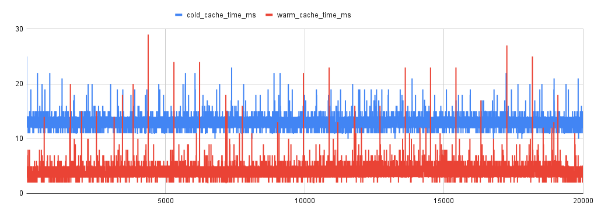
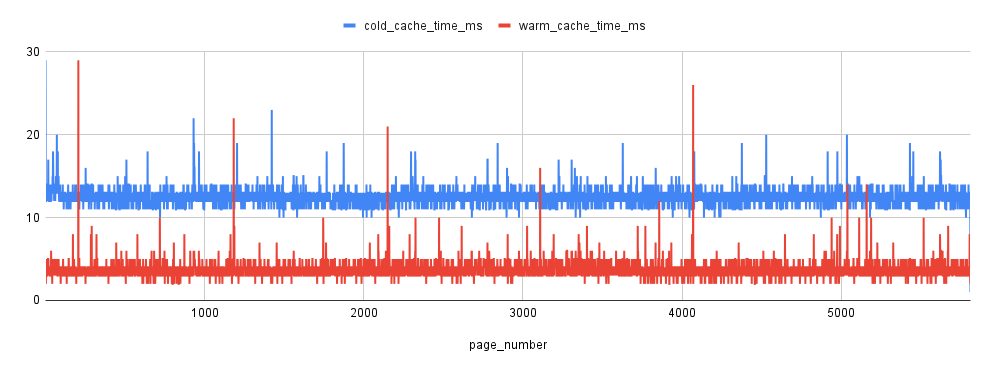

# Performance Testing

## Overview
This document details the performance testing conducted on the MyTheresa Promotions Test implementation. The focus is to evaluate the system's efficiency, particularly in terms of pagination, caching, and discount application.

---

## Testing Methodology

### Test Environment
These tests were ran under these circumstance:
- **Hardware:** Macbook pro m1 with 10 core and 16G Ram
- **Seeds:** Data were seeded using the seeder script.
  - Products: 100,000
  - Discounts: 1,000
  - Categories: 3


### 1. **Redis Warm-Up (Cold Cache)**
- **Objective:** Measure response times when Redis is not preloaded with discount data.
- **Steps:**
  1. Start with an empty Redis instance.
  2. Query the `/v1/products` endpoint with filters and pagination.
  3. Record response times for multiple pages (e.g., page 1 to page 10,000).

### 2. **Warm Cache Testing**
- **Objective:** Measure response times after Redis is populated with discount data.
- **Steps:**
  1. Preload Redis with all relevant discounts (`sku` and `category`).
  2. Query the `/v1/products` endpoint as before.
  3. Record response times and compare with the cold cache results.

### 3. **Iteration Tests**
- **Objective:** Simulate user navigation across multiple pages.
- **Steps:**
  1. Start at page 1 and iteratively fetch the next pages using `next` cursor.
  2. Repeat for different filter combinations.


### 4. **Filter criteria**
- **Objective:** Measure the response time for when there is filter and no-filter
- **Steps:**
  1. Define criteria in request Query param (eg. priceLessThan=30000)
  2. Clear cache before doing the warm/cold test for each criteria
---

## Results and Observations

### 1. **Cold Cache Results**
- Average response time: `12.88 ms`
- Observations:
  - Initial queries showed higher response times due to database lookups for discounts.
  - Pagination queries remained consistent in performance.

### 2. **Warm Cache Results**
- Average response time: `3.98 ms` (significantly faster than cold cache).
- Observations:
  - Redis caching drastically reduced the time taken to retrieve discounts.
  - Subsequent queries demonstrated near-linear response times.


### 3. Analysis: Mean, Median, and More

In addition to recording response times, we analyzed the statistical performance of the system using mean, median, and other metrics:

1. **Mean Response Time:**
   - The average response time was calculated to determine the overall performance during both cold and warm cache tests.
   - Formula:
     ```
     mean = (sum of all response times) / (number of requests)
     ```

2. **Median Response Time:**
   - The median response time was measured to assess the consistency of performance, as it is less influenced by outliers compared to the mean.
   - Observations:
     - In cold cache scenarios, the median was higher due to Redis misses.
     - In warm cache scenarios, the median dropped significantly, indicating consistent performance.

3. **P95 and P99:**
   - The 95th and 99th percentile response times were analyzed to ensure that even the slowest requests performed within acceptable limits.
   - Observations:
     - P95 and P99 showed improvement with caching, as fewer database queries were required.

### Results Summary

| Metric                  | Cold Cache (ms) | Warm Cache (ms) |
|-------------------------|-----------------|-----------------|
| **Mean Response Time**  | 12.88           | 3.98            |
| **Median Response Time**| 14              | 4               |
| **P95**                 | 14              | 5               |
| **P99**                 | 15              | 7               |

These metrics demonstrate that the use of Redis significantly improves performance and ensures consistent response times for a better user experience.

Results are visualized in Google Sheets with response time trends plotted across pages.


---

### 4. Performance with filters
When we applied filters as well (`/v1/products?priceLessThan=30000`), we saw that the response time did not change that much (since price is indexed). The total number of products with prices less than 30000 was 29049 (out of total 100,000 products).
Below you can see the metrics and the visualization.

| Metric                  | Cold Cache (ms) | Warm Cache (ms) |
|-------------------------|-----------------|-----------------|
| **Mean Response Time**  | 12.43           | 3.70            |
| **Median Response Time**| 15              | 3               |
| **P95**                 | 14              | 5               |
| **P99**                 | 15              | 6               |



## Tools Used
- **Golang seeding Scripts:** For populating the database with products/discounts/categories.
- **Golang performance Scripts:** For iterating over pages and collecting response times.
- **Google Sheets:** Used for charting and visualizing the results.